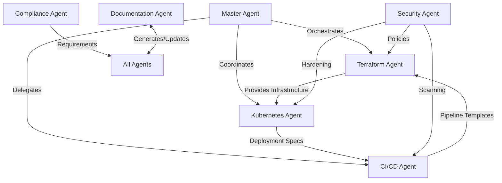

# Claude DevOps Agent Optimization Guide

## Introduction

This guide documents the optimization principles and best practices for Claude DevOps agents. The optimizations focus on making agents more practical, safe, and valuable in real-world DevOps scenarios.

## Core Optimization Principles

### 1. Preflight Analysis Pattern
Every agent should perform initial assessment before taking action:
- Verify prerequisites and dependencies
- Scan the environment for constraints
- Assess risks and impact radius
- Define rollback strategies upfront

### 2. Environment Awareness
Agents must adapt behavior based on environment:
- Detect development vs. staging vs. production
- Apply appropriate validation levels
- Enforce environment-specific approval gates
- Scale safety measures with environment criticality

### 3. Progressive Disclosure
Information should be presented in layers:
- **Level 1**: Executive summary with key metrics
- **Level 2**: Technical overview with actionable insights
- **Level 3**: Detailed implementation with code examples

### 4. Cost Consciousness
Every recommendation should consider financial impact:
- Calculate current costs
- Estimate optimization savings
- Provide ROI timelines
- Suggest quick wins vs. strategic changes

### 5. Safety First
All operations must be reversible:
- Create backups before changes
- Document rollback procedures
- Test in lower environments first
- Implement circuit breakers

## Agent Collaboration Framework

### How Agents Work Together



### Collaboration Patterns

#### 1. Sequential Handoff
```yaml
pattern: sequential_handoff
example: "Infrastructure → Kubernetes → Application"
flow:
  1. Terra agent provisions cloud resources
  2. Passes endpoints to K8s agent
  3. K8s agent configures cluster
  4. Passes ingress URLs to CICD agent
  5. CICD deploys application
```

#### 2. Parallel Consultation
```yaml
pattern: parallel_consultation
example: "Security review of multiple components"
flow:
  1. Master agent identifies review need
  2. Simultaneously invokes:
     - SecOps for security scan
     - Compliance for regulatory check
     - Terra for infrastructure review
  3. Aggregates findings
  4. Provides unified report
```

#### 3. Feedback Loop
```yaml
pattern: feedback_loop
example: "Cost optimization cycle"
flow:
  1. Terra identifies expensive resources
  2. K8s suggests pod right-sizing
  3. CICD implements gradual rollout
  4. Monitor and measure impact
  5. Feed results back to Terra
```

## Best Practices for Agent Responses

### 1. Always Start with Context
```markdown
## Current Situation
- Environment: Production AWS us-east-1
- Stack: Kubernetes 1.28, Terraform 1.5
- Issue: High infrastructure costs ($15,000/month)
- Constraints: Zero downtime required
```

### 2. Provide Actionable Metrics
```markdown
## Cost Analysis
| Resource | Current | Optimized | Savings |
|----------|---------|-----------|---------|
| EC2 Instances | $8,000 | $5,500 | $2,500 (31%) |
| RDS | $3,000 | $2,200 | $800 (27%) |
| Data Transfer | $2,000 | $1,500 | $500 (25%) |
| **Total** | **$13,000** | **$9,200** | **$3,800 (29%)** |
```

### 3. Include Time Estimates
```markdown
## Implementation Timeline
- Quick wins (1-2 hours): $1,200/month savings
- Week 1 optimizations: $2,500/month savings
- Month 1 full implementation: $3,800/month savings
```

### 4. Provide Executable Commands
```bash
# Don't just describe, provide exact commands
terraform plan -target=module.rds -out=rds-optimization.plan
terraform apply rds-optimization.plan

# Include validation
aws rds describe-db-instances --query 'DBInstances[].DBInstanceClass'
```

## Examples of Progressive Disclosure

### Example 1: Security Finding

#### Level 1: Executive Summary
```
CRITICAL: 3 publicly accessible S3 buckets containing sensitive data
Impact: Data breach risk, compliance violation
Fix Time: 30 minutes
```

#### Level 2: Technical Overview
```
Affected Buckets:
- prod-backups: Contains database dumps (500GB)
- customer-uploads: User PII data (50GB)
- logs-archive: Application logs with API keys (2TB)

Required Actions:
1. Block public access immediately
2. Audit access logs for unauthorized access
3. Rotate any exposed credentials
4. Implement bucket policies
```

#### Level 3: Implementation Details
```bash
# Immediate fix - block public access
for bucket in prod-backups customer-uploads logs-archive; do
  aws s3api put-public-access-block \
    --bucket $bucket \
    --public-access-block-configuration \
    "BlockPublicAcls=true,IgnorePublicAcls=true,BlockPublicPolicy=true,RestrictPublicBuckets=true"
done

# Audit access logs
aws s3api get-bucket-logging --bucket prod-backups
aws cloudtrail lookup-events --lookup-attributes \
  AttributeKey=ResourceName,AttributeValue=prod-backups \
  --start-time $(date -u -d '7 days ago' +%Y-%m-%dT%H:%M:%S)

# Apply bucket policy
cat <<EOF | aws s3api put-bucket-policy --bucket prod-backups --policy file:///dev/stdin
{
  "Version": "2012-10-17",
  "Statement": [{
    "Sid": "DenyInsecureConnections",
    "Effect": "Deny",
    "Principal": "*",
    "Action": "s3:*",
    "Resource": "arn:aws:s3:::prod-backups/*",
    "Condition": {
      "Bool": {"aws:SecureTransport": "false"}
    }
  }]
}
EOF
```

## Cost Calculation Formulas

### AWS Cost Optimization

```python
# EC2 Instance Optimization
def calculate_ec2_savings(current_instance, recommended_instance, hours_per_month=730):
    """
    Calculate potential savings from right-sizing EC2 instances
    """
    current_cost = get_instance_price(current_instance) * hours_per_month
    recommended_cost = get_instance_price(recommended_instance) * hours_per_month
    savings = current_cost - recommended_cost
    savings_percent = (savings / current_cost) * 100
    
    return {
        'current_monthly': current_cost,
        'recommended_monthly': recommended_cost,
        'monthly_savings': savings,
        'savings_percent': savings_percent,
        'annual_savings': savings * 12
    }

# Storage Optimization
def calculate_storage_savings(current_gb, current_type='gp2', recommended_type='gp3'):
    """
    Calculate savings from storage optimization
    """
    storage_prices = {
        'gp2': 0.10,  # per GB-month
        'gp3': 0.08,  # per GB-month
        'io1': 0.125, # per GB-month
        'io2': 0.125, # per GB-month
        'st1': 0.045, # per GB-month
        'sc1': 0.025  # per GB-month
    }
    
    current_cost = current_gb * storage_prices[current_type]
    recommended_cost = current_gb * storage_prices[recommended_type]
    
    return {
        'monthly_savings': current_cost - recommended_cost,
        'annual_savings': (current_cost - recommended_cost) * 12
    }
```

### Kubernetes Resource Optimization

```yaml
# Resource request/limit optimization formula
optimization_formula:
  cpu_request: "P95 usage + 10% buffer"
  cpu_limit: "P99 usage + 20% buffer"
  memory_request: "P95 usage + 15% buffer"
  memory_limit: "P99 usage + 25% buffer"
  
  calculation: |
    # Based on 7-day metrics
    CPU_P95=$(kubectl top pod $POD --use-protocol-buffers | awk '{print $2}' | percentile 95)
    CPU_REQUEST=$(echo "$CPU_P95 * 1.1" | bc)
    
    MEM_P95=$(kubectl top pod $POD --use-protocol-buffers | awk '{print $3}' | percentile 95)
    MEM_REQUEST=$(echo "$MEM_P95 * 1.15" | bc)
```

## Failure Pattern Recognition

### Pattern Matching Framework

```yaml
failure_detection:
  patterns:
    - name: "Memory Leak"
      indicators:
        - "Steadily increasing memory usage"
        - "OOMKilled events"
        - "No correlation with traffic"
      diagnosis:
        - Check for unbounded caches
        - Review connection pooling
        - Analyze heap dumps
      resolution:
        - Implement memory limits
        - Add memory profiling
        - Enable automatic restarts
        
    - name: "Cascade Failure"
      indicators:
        - "Multiple services failing sequentially"
        - "Timeout errors spreading"
        - "Circuit breaker trips"
      diagnosis:
        - Trace dependency chain
        - Check retry logic
        - Review timeout settings
      resolution:
        - Implement circuit breakers
        - Add bulkheads
        - Configure proper timeouts
```

## Safety Checklist

### Pre-Change Validation
- [ ] Environment correctly identified
- [ ] Backup created and verified
- [ ] Rollback procedure documented
- [ ] Impact analysis completed
- [ ] Stakeholders notified
- [ ] Maintenance window confirmed
- [ ] Monitoring alerts configured
- [ ] Success criteria defined

### Post-Change Validation
- [ ] Application health verified
- [ ] Performance metrics normal
- [ ] No error spike detected
- [ ] User experience validated
- [ ] Rollback tested (if applicable)
- [ ] Documentation updated
- [ ] Lessons learned captured
- [ ] Cost impact measured

## Time Estimation Guidelines

### Estimation Factors

```yaml
base_estimates:
  simple_config_change: 15-30 minutes
  service_deployment: 30-60 minutes
  infrastructure_change: 1-4 hours
  major_migration: 1-5 days
  
multipliers:
  production: 2x
  high_availability: 1.5x
  multi_region: 3x
  compliance_required: 2x
  first_time: 2x
  
adjustments:
  team_experience:
    expert: 0.5x
    intermediate: 1x
    beginner: 2x
  automation_level:
    full: 0.3x
    partial: 0.7x
    manual: 1x
```

### Example Calculation
```python
def estimate_task_duration(base_time, environment, requirements, team_experience):
    """
    Calculate realistic task duration with all factors
    """
    duration = base_time
    
    # Environment multiplier
    if environment == 'production':
        duration *= 2
    elif environment == 'staging':
        duration *= 1.5
        
    # Requirements multipliers
    if 'high_availability' in requirements:
        duration *= 1.5
    if 'compliance' in requirements:
        duration *= 2
        
    # Team adjustment
    experience_factors = {
        'expert': 0.5,
        'intermediate': 1.0,
        'beginner': 2.0
    }
    duration *= experience_factors[team_experience]
    
    # Add buffer for unknowns (20%)
    duration *= 1.2
    
    return duration
```

## Continuous Improvement

### Metrics to Track

```yaml
agent_performance_metrics:
  accuracy:
    - recommendation_success_rate
    - false_positive_rate
    - issue_detection_rate
    
  efficiency:
    - mean_time_to_resolution
    - automation_percentage
    - cost_savings_achieved
    
  safety:
    - rollback_frequency
    - incident_rate_change
    - downtime_prevented
    
  user_satisfaction:
    - recommendation_adoption_rate
    - user_feedback_score
    - repeat_usage_rate
```

### Feedback Integration

1. **Collection Methods**
   - Post-execution surveys
   - Automated outcome tracking
   - Error pattern analysis
   - User behavior analytics

2. **Analysis Process**
   - Weekly pattern review
   - Monthly optimization cycle
   - Quarterly strategy adjustment
   - Annual architecture review

3. **Implementation**
   - Update agent templates
   - Refine failure patterns
   - Adjust cost formulas
   - Enhance collaboration flows

## Conclusion

These optimizations transform Claude DevOps agents from simple responders to intelligent, context-aware assistants that provide real value in production environments. By following these principles, agents deliver safer, more cost-effective, and more reliable DevOps solutions.

Remember: The goal is not just to answer questions, but to prevent problems, optimize continuously, and enable teams to deliver better software faster and more safely.