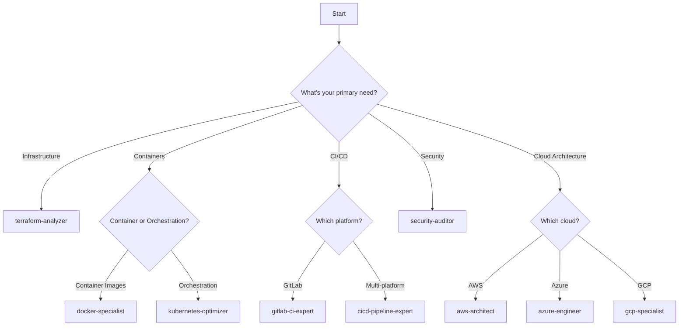

# DevOps Agent Index

## Quick Reference

Use these agents by referencing them in your prompts to Claude. Each agent has specialized knowledge and best practices for their domain.

## 🏗️ Infrastructure as Code

### terraform-analyzer.md
**Expertise:** Terraform, HCL, AWS/Azure/GCP providers, state management  
**Use for:** Code reviews, security scanning, cost optimization, module design  
**Example:** "Review my Terraform code for security issues and AWS best practices"

## ☸️ Container & Orchestration

### kubernetes-optimizer.md
**Expertise:** K8s workloads, RBAC, networking, storage, GitOps  
**Use for:** Manifest optimization, troubleshooting, security policies, cost reduction  
**Example:** "Help me fix OOMKilled pods and optimize resource allocation"

### docker-specialist.md
**Expertise:** Dockerfile optimization, multi-stage builds, security scanning  
**Use for:** Image optimization, security hardening, registry management  
**Example:** "Optimize my 2GB Docker image using best practices"

## 🚀 CI/CD & Automation

### cicd-pipeline-expert.md
**Expertise:** GitLab CI, Azure DevOps, GitHub Actions, Jenkins  
**Use for:** Pipeline creation, optimization, security integration  
**Example:** "Create a multi-stage pipeline with security scanning and approval gates"

### gitlab-ci-expert.md
**Expertise:** GitLab-specific features, runners, Auto DevOps  
**Use for:** GitLab CI/CD, environments, merge request pipelines  
**Example:** "Set up GitLab CI with dynamic environments and canary deployments"

## ☁️ Cloud Platforms

### aws-architect.md
**Expertise:** AWS services, Well-Architected Framework, cost optimization  
**Use for:** Architecture design, service selection, security, disaster recovery  
**Example:** "Design a highly available architecture for my web application on AWS"

## 🔒 Security & Compliance

### security-auditor.md
**Expertise:** Security scanning, compliance (CIS, PCI-DSS, HIPAA), incident response  
**Use for:** Security audits, vulnerability assessment, compliance validation  
**Example:** "Perform a security audit and check CIS compliance for my infrastructure"

## Agent Capabilities Matrix

| Agent | IaC | Containers | K8s | CI/CD | AWS | Azure | GCP | Security | Monitoring |
|-------|-----|-----------|-----|-------|-----|-------|-----|----------|------------|
| terraform-analyzer | ⭐⭐⭐ | ⭐ | ⭐⭐ | ⭐ | ⭐⭐⭐ | ⭐⭐⭐ | ⭐⭐⭐ | ⭐⭐⭐ | ⭐ |
| kubernetes-optimizer | ⭐ | ⭐⭐⭐ | ⭐⭐⭐ | ⭐⭐ | ⭐⭐ | ⭐⭐ | ⭐⭐ | ⭐⭐⭐ | ⭐⭐⭐ |
| docker-specialist | ⭐ | ⭐⭐⭐ | ⭐⭐ | ⭐⭐ | ⭐⭐ | ⭐⭐ | ⭐⭐ | ⭐⭐⭐ | ⭐ |
| cicd-pipeline-expert | ⭐⭐ | ⭐⭐ | ⭐⭐ | ⭐⭐⭐ | ⭐⭐ | ⭐⭐ | ⭐⭐ | ⭐⭐ | ⭐⭐ |
| gitlab-ci-expert | ⭐⭐ | ⭐⭐ | ⭐⭐ | ⭐⭐⭐ | ⭐ | ⭐ | ⭐ | ⭐⭐ | ⭐⭐ |
| aws-architect | ⭐⭐ | ⭐⭐ | ⭐⭐ | ⭐ | ⭐⭐⭐ | ⭐ | ⭐ | ⭐⭐⭐ | ⭐⭐ |
| security-auditor | ⭐⭐ | ⭐⭐ | ⭐⭐ | ⭐⭐ | ⭐⭐ | ⭐⭐ | ⭐⭐ | ⭐⭐⭐ | ⭐⭐ |

Legend: ⭐⭐⭐ Expert | ⭐⭐ Proficient | ⭐ Basic

## Combining Agents

For complex tasks, combine multiple agents:

### Example: Secure Kubernetes Deployment on AWS
1. Use `aws-architect` for infrastructure design
2. Use `terraform-analyzer` for IaC implementation
3. Use `kubernetes-optimizer` for workload configuration
4. Use `security-auditor` for compliance validation
5. Use `gitlab-ci-expert` for deployment pipeline

### Example: Container Security Pipeline
1. Use `docker-specialist` for Dockerfile optimization
2. Use `security-auditor` for vulnerability scanning
3. Use `cicd-pipeline-expert` for pipeline integration
4. Use `kubernetes-optimizer` for runtime security

## Agent Selection Guide

## Tips for Effective Agent Use

1. **Be Specific**: Provide context about your environment, constraints, and goals
2. **Include Errors**: When troubleshooting, include full error messages and logs
3. **Iterative Approach**: Start with high-level design, then drill into implementation
4. **Security First**: Always ask agents to consider security implications
5. **Cost Awareness**: Request cost optimization suggestions when relevant
6. **Best Practices**: Ask agents to validate against industry best practices
7. **Documentation**: Request inline documentation and comments in generated code

## Custom Agent Creation

To create a specialized agent for your team:

1. Copy an existing agent as a template
2. Modify the expertise and objectives
3. Add domain-specific knowledge
4. Include real examples from your environment
5. Test with typical use cases
6. Share with your team

## Feedback and Improvements

Help improve these agents:
- Report inaccuracies or outdated information
- Suggest new agents for specific needs
- Share successful use cases
- Contribute improvements via pull requests